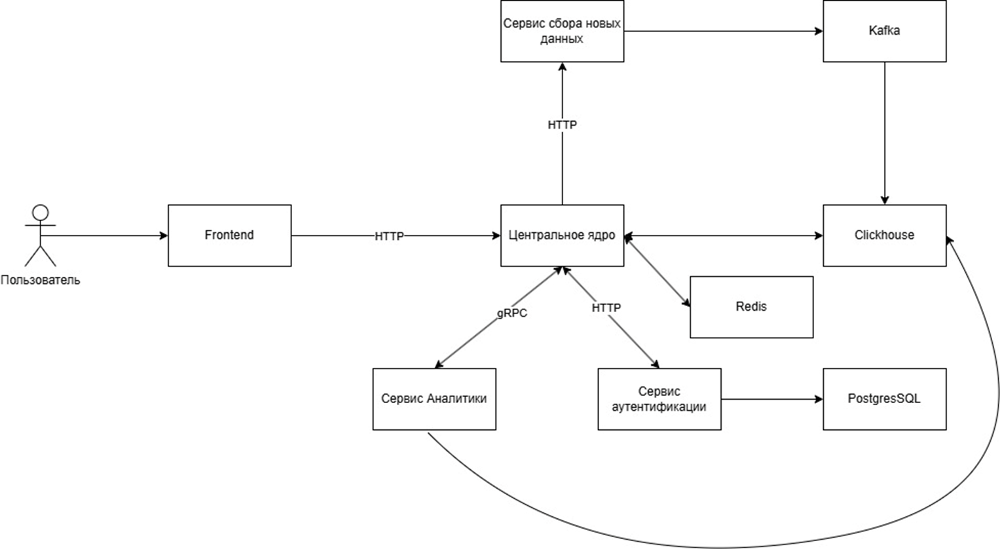

# Клиент-серверное приложение для спортивной аналитики

## О проекте

Веб-приложение, построенное на микросервисной архитектуре. Структурно проект состоит из 4 основных микросервисов:
1. [*Основной сервис, принимающий клиентские HTTP-запросы (Центральное ядро)*](/services/core_api) (Ещё не реализовано)
2. [*Сервис сбора новых данных*](/services/data_collector) 
3. [*Сервис аутентификации*](/services/auth_service)
4. [*Сервис аналитики*](/services/analytics_service) (Ещё не реализовано)

Пользователь может получать актуальные статистические данные о футбольных событяих в 9 чемпионатах европейских стран. Данные обновляются автоматически. Так же планируется сделать отдельный функционал с продвинутой аналитикой на Python.

## Стек технологий

- Go 1.24.5 - основной язык программирования (центральное ядро, сервис сбора данных, сервис аутентификации)
- Pytnon 3.10+ - язык программирования для сервиса аналитики 
- Clickhouse - БД с аналитическими данными
- PostgreSQL - БД с данными пользователей
- Redis - кэш-БД для ускорения работы приложения
- Docker, k8s - виртуализация решения
- HTTP, gRPC - микросервисное взаимодействие и клиент-серверное взаимодействие
- Apache Kafka - брокер сообщений для гарантии доставки
- Elasticsearch - для "умного" поиска по БД
- JWT + bcrypt — для аутентификации пользователей и безопасности

## Более подробная информация о сервисах
### Сервис аутентификации
Аутентификация организовано при помощи технологий JWT (JSON Web Token) с подписью HS256 для аутентификации и авторизации пользователя, а так же удержания пользовательской сессии. 
Так же организована регистрация пользователей с безопасным хешированием пароля при помощи хешкриптографической хеш-функции bcrypt. Данные пользователей записываются в БД PostgreSQL. Сервис поднимается в docker-контейнере (описан в Dockerfile).
Запускается сервис в docker-контейнере при помощи файла docker-compose.

### Сервис сбора новых данных
Новые данные собираются с помощью API api.sofascore. Данное api оборудовано защитой от запросов ботов и скриптов, поэтому эмулируется работа реального браузера Chrome при помощи
пакета chromedp (кроме того, с помощью docker предоставляется подходящая среда для работы данного пакета). Запросы к api выполняются многопоточно, что многократно ускоряет работу сервиса. Количество потоков определяется в зависимости от объема текущей задачи. Обновление данных может инициироваться:
- Через REST endpoints
- Автоматически по расписанию через встроенный Scheduler

Все данные записываются в БД Clickhouse, наиболее подходящую для аналитической информации, через брокер сообщений Kafka (поднят так же в docker),
что обеспечивает гарантию доставки каждого батча информации в БД из апи. На данный момент в Clickhouse хранится >1,5кк записей, и их количество постоянно пополняется.
Запускается сервис в docker-контейнере при помощи файла docker-compose.

### Основной сервис (Центральное ядро)
Еще в разработке...

### Сервис аналитики
Еще в разработке...

## Архитектурная схема приложения

## Тестирование
На все ключевые функции приложения написаны unit-тесты, запускаемые при помощи утилиты go test.

